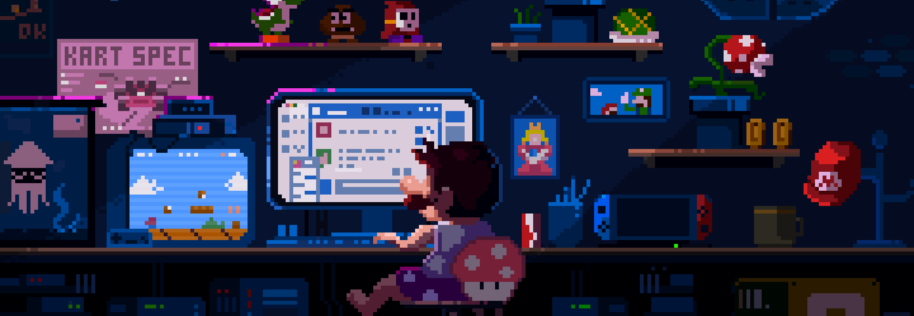

  

<h1 align="center">Hey there, I'm Pranay 👋</h1>

<h3 align="center">
  
</h3>

  

---

## 🧑‍💻 About Me

- 🎓 Pursuing **B.Tech in Computer Science & Engineering** at **IIIT Nagpur**
- 🧠 Figuring out AI
- 🛠️ Building projects that solve real-world problems
- 🚀 Looking for my next engineering adventure

---

## 🌐 Connect with Me

  
  
  
  

---

## 🛠️ Tech Stack

**Languages**

  
  
  
  
  
  
  
  

**Frontend**

  
  
  
  
  
  
  

**Backend**

  
  
  
  

**Databases**

  
  
  
  
  
  

**DevOps & Cloud**

  
  
  
  
  
  
  

**ML / AI**

  
  
  

**Tools & Others**

  
  
  
  

---

## 📊 GitHub Stats

  
  

  

---

  <i>⚡ "First, solve the problem. Then, write the code." — John Johnson</i>

